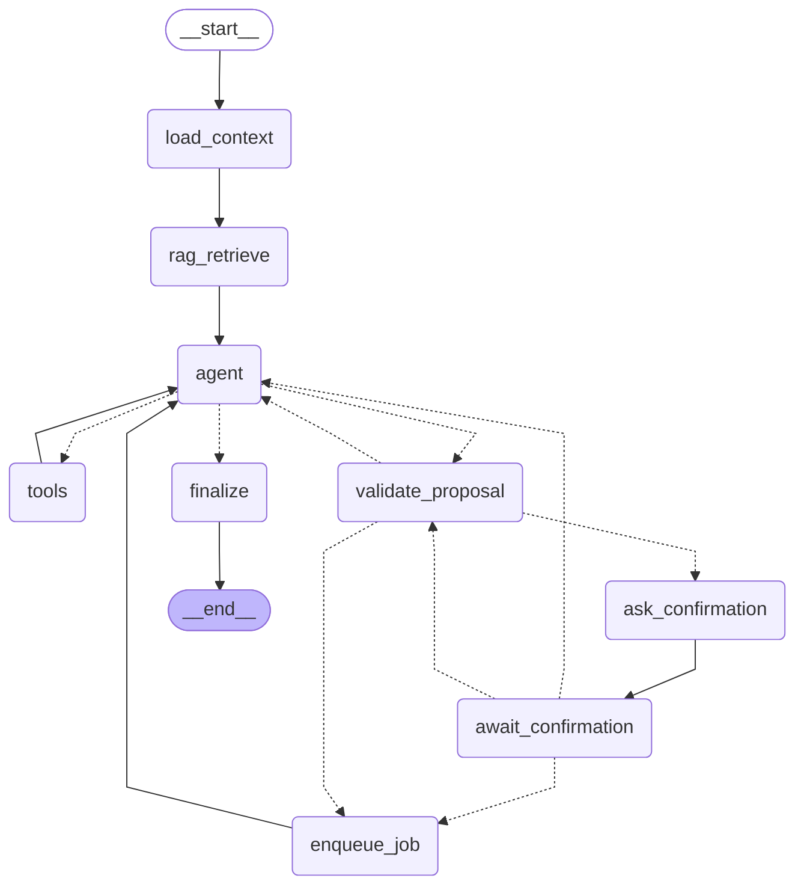

# Agent Graph Visualization (LangGraph)

```mermaid
---
config:
  flowchart:
    curve: linear
---
graph TD;
	__start__([<p>__start__</p>]):::first
	load_context(load_context)
	rag_retrieve(rag_retrieve)
	agent(agent)
	tools(tools)
	validate_proposal(validate_proposal)
	ask_confirmation(ask_confirmation)
	await_confirmation(await_confirmation)
	enqueue_job(enqueue_job)
	finalize(finalize)
	__end__([<p>__end__</p>]):::last
	__start__ --> load_context;
	agent -.-> finalize;
	agent -.-> tools;
	agent -.-> validate_proposal;
	ask_confirmation --> await_confirmation;
	await_confirmation -.-> agent;
	await_confirmation -.-> enqueue_job;
	await_confirmation -.-> validate_proposal;
	enqueue_job --> agent;
	load_context --> rag_retrieve;
	rag_retrieve --> agent;
	tools --> agent;
	validate_proposal -.-> agent;
	validate_proposal -.-> ask_confirmation;
	validate_proposal -.-> enqueue_job;
	finalize --> __end__;
	classDef default fill:#f2f0ff,line-height:1.2
	classDef first fill-opacity:0
	classDef last fill:#bfb6fc

```
